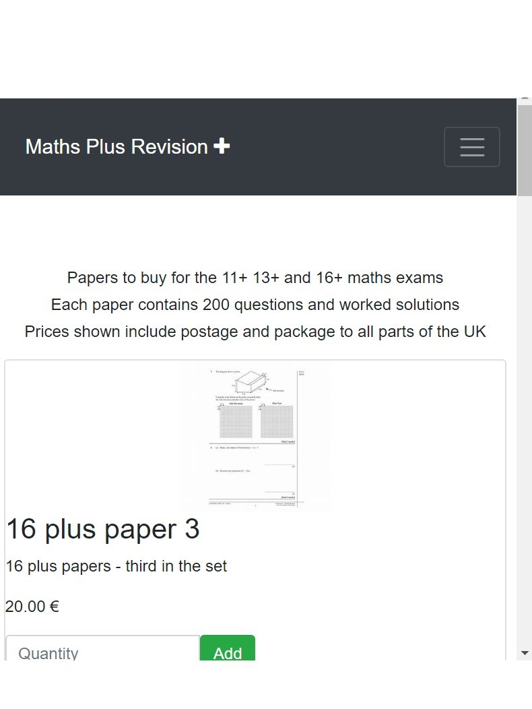

# [Maths Plus Revision](https://maths-plus-revision.herokuapp.com/)


 

This is a revision app for students taking the maths 11 plus 13 plus and 16 plus exams.

I designed a revision app for students who are studying for demanding 11 plus, 13 plus and 16 plus exams in maths.  The exams are hard work and currently there is no existing central resource for students to use.  Thus the idea was to put useful past and practice papers with markschemes and advice, together in this app.  The app is to be used mainly by parents of students who are taking these exams.

Parents can view and order one paper and its associated markscheme for free and then they can order extra papers and markschemes using stripe.
The app was deployed to heroku and can be accessed by clicking on the title above.   Alternatively here is a link to the [heroku app.](<https://maths-plus-revision.herokuapp.com/>)

## UX

### User persona

The typical user is a parent aged in their mid 30s to mid 50s.  The user persona's name is Paul.  Paul is the parent of three children who are aged 10, 12 and 15.  Each child will soon take the 11+, 13+ and 16+ exam respectively in order to gain a place at a top independent school. Paul is keen for his children to receive an education at a top school as he knows that this means that his children are more likely to gain entry to excellent universities and better career paths, as well as being part of a privileged network.

Paul has an income of around £300000 per year and is happy to pay school fees totalling around £80000 per year for his 3 children.   All his children have been preparing for their entrance exams over the last year and have been using published resources and other resources downloadable from other ecommerce sites.  This app gives Paul the opportunity to buy 11+, 13+ and 16+ papers which are not available elsewhere.

Paul expects to see a range of papers to purchase which is updated on a regular basis. Paul also expects the welcome page to display some sort of image which gives him the message that this is the sort of site where he can trust the quality of the papers.

Many users like Paul will use the app.  Below is a list of their expectations for the app.

## User stories

1. Each user has a unique username chosen by them and password and a user profile showing past and present orders.
2. Users can choose to reset their password when needed.
3. A user who has forgotten their password can be issued with a temporary password, go onto the site,then reset their password using a given link.
4. A user can see 11 plus, 13 plus and 16 plus papers to select from without logging in.
5. A user can only purchase 11 plus, 13 plus or 16 plus papers if they are logged in.
6. If a user attempts to buy these papers without login in, the app will direct them to login.
7. Once logged in, the user can checkout items in the cart.
8. A user will see a message on the screen stating that they are logged in.
9. If a user does not have an account they will be directed to create one.
10. Once a user has created an account, they will see a message on the screen informing them that their account has been successfully created.
11. A user can select items to be purchased and each item selected will be added to their cart.
12. A user will be able to view all the items in their cart.
13. A user can choose to checkout items using the checkout button.  A user can amend items in their cart before checkout. At checkout a user will be asked for their details.
14. Checked out items will be paid for using credit or debit cards.
15. The user will get an acknowledgement of payment.
16. A user can access a blog on the app from the main menu.
17. The blog will contain tips on learning maths and ideas on how to measure progress made.
18. A contact address appears on the about us page for users to use if required.
19. A logged in or logged out user can see a blog which gives extra information on study skills and learning maths.
20. A user can see how many times each post has been viewed together with the name of the author and the date the blog post was created.

## Design features

* The navbar must appear on every page so that the user can easily navigate between pages.

* The navbar has the title of of the website, "Maths Plus Revision" on the left hand side.  If a user clicks on this they are taken to the Papers page.

* The home page shows the following items in the navbar:  "MathsPlusRevision", "About Us", "Register", "Log in", "Blog", "Cart"


* A logged out user can see all these items and can select papers to purchase, but they will need to either log in or register an account in order to purchase papers.

* On logging in or creating an account a user is first take to the about us page which gives some information about the site.  A user will know that they are logged in as a message will appear on the top left of the screen.


* Once a paper has been selected and has been put in the cart, the user is taken to the checkout page. The cart icon will change to show the number of items in the cart and the user can then click on checkout to buy these papers.


* If a user does not chose a quantity of papers and then hits add an error message will be shown and the user will be asked to click the paper tab and select a quantity of a paper to purchase.  Clicking on the paper tab at any time will allow the user to select more papers if needed.


* A logged out user will see a logged out message on the screen to indicate that they are logged out.


* The blog page can be seen by all users regardless of whether or not they are logged in.


## Technologies Used

* [HTML](https://www.w3schools.com/html/) or Hypertext markup language. HTML is used to create the structure of web pages. It consists of tags which tell the browser how to set out text and images on the page. Hypertext is the method by which you move around on the web, markups are the tags which set out the structure of the webpage, thus HTML is a language for web creation with its own structure and syntax. The data in the tags is read by the web browser enabling you to create any web page you like. In this project my templates are all written in HTML. There is a template for adding, deleting, editing and adding recipes as well as one for viewing information about each island. The base template sets out the way in which the website should look and information from this is used in each of the other templates.

* [CSS](https://www.w3schools.com/Css/) stands for Cascading Style sheets which is a type of style language which sets out how the webpage should be styled. It allows the user to style the webpage in a particular way, making the UX richer and more meaningful for the user.

* [Django](https://www.djangoproject.com/) is a web development framework that assists in building and maintaining quality web applications. Django helps eliminate repetitive tasks making the development process an easy and time saving experience.

* [jquery](https://jquery.com/) is used to simplify DOM manipulation. Jquery is a javascript library that is used to provide interactivity on websites. The $ sign signals to the browser that jquery is being used.

* [Python](https://www.python.org/psf-landing/) is a high level programming language used for apps in many frameworks such as flask, pyramid and django. Python supports many programming paradigms and is object orientated and has a comprehensive set of libraries. Python is managed by a non profit organsation the Python software foundation.  The version of Python I used in my app is 3.7.

* I used [Postgres](https://www.postgresql.org/) for the models in my database, although sqlite3 was available in django. This was because my app is deployed to heroku and heroku is an ephemeral file system so my data would disappear each time I logged into heroku! Postgres is an open source object-relational database system that provides the user with the facility to create, read, update and delete documents data.

* [Heroku](https://www.heroku.com/) is a cloud platform that allows a developer to build, deliver, scale and monitor apps. Heroku makes the experience of deploying an app relatively straightforward.

* I used [Chrome Developer Tools](https://developers.google.com/web/tools/chrome-devtools/) to work on my code. Chrome dev tools are a set of tools designed to give the developer tools to amend code in a testing environment in order to enhance the UX and functionality experience. I was also able to test the responsiveness of my app using these tools.

* I used [vscode](https://code.visualstudio.com/) as my coding editor.  I found it easy to use and used extensions for markup and also extensions to check the syntax of my code.

## Databases used

[SQLite3](https://www.sqlite.org/index.html) is a database provided by django and is the default database for django projects.
[Postgres](https://www.postgresql.org/) is an open source relational database.

Django does not determine a type of database to be used.  I decided to use postgres as heroku is an ephemeral system meaning that data stored in SQLite would disappear each time I accessed the app!

## Data Models used

In Django, data models are the databases which store data about the objects in the database.  The MathsRevisionPlus app used 2 models in addition to the django provided user model which stored details of users.  The models were:

### Product model

Name | Key in db | Validation| Fieldtype
-----|----------| ----------|-------
Name| name |maxlength=254|Charfield
Description|description|no maxlength|Textfield
Price|price|maxdigits=6, decimalplaces=2|Decimalfield
Image|image|nomaxlength|Upload to images

### Order model

Name | Key in db | Validation| Fieldtype
-----|----------| ----------|-------
Fullname| full_name |maxlength=150|Charfield
AddressLine1|address_line_1|maxlength=150|Charfield
AddressLine2|address_line_2|maxlength=150, blank=True|Charfield
Town/City|town_or_city|maxlength=150|Charfield
County|county|max_length=150,blank=True|Charfield
Postcode|postcode|max_length=10|Charfield
Date ordered|date_ordered|default=date.time.today|DateField

* An order is created first before order line item is created as orderline item connects to order using a foreign key.

### OrderLineItem model

Name | Key in db | Validation| Fieldtype
-----|----------| ----------|-------
Order| order |maxlength=150|Charfield
Product|product|maxlength=150|Charfield
Quantity|quantity|maxlength=150, blank=True|Charfield

*An instance of orderlineitem is only created on receipt of an order by a user for each item the user selects and places in the cart so it uses a foreign key.

### Posts model

Name | Key in db | Validation| Fieldtype
-----|----------| ----------|-------
Title| title |maxlength=200|Charfield
Content|content|no maxlength|Textfield
Created date|createddate|dateformat = 6 chars|DateTimefield
Published date|publisheddate|dateformat=6 chars|DateTimeField
Views|views|no max length|IntegerField
Tag|tag|maxlength=30|Textfield

## Testing

Testing was carried out by human beings.

* Manual Testing

I tested each part of my user story to check it worked as expected.

1. Each user has a unique username chosen by them and password and a user profile showing their login and email and a thank you message.
Result:  works as expected.

2. Users can choose to reset their password when needed.
Result:  works as expected.

3. A user who has forgotten their password can be issued with a temporary password, go onto the site,then reset their password using a given link.
Result:  works as expected.

4. A user can see 11 plus, 13 plus and 16 plus papers to select from without logging in.
Result:  Works as expected.

5. A user can only purchase 11 plus, 13 plus or 16 plus papers if they are logged in.
Result:  Works as expected.

6. If a user attempts to buy these papers without login in, the app will direct them to login.
Result: Works as expected.  

7. Once logged in, the user can checkout items in the cart.
Result:  Works as expected.

8. A user will see a message on the screen stating that they are logged in.
Result:  Works as expected.

9. If a user does not have an account they will be directed to create one.
Result:  Works as expected.

10. Once a user has created an account, they will see a message on the screen informing them that their account has been successfully created.
Result:  Works as expected.

11. A user can select items to be purchased and each item selected will be added to their cart.
Result: Works as expected.

12. A user will be able to view all the items in their cart.
Result: Works as expected.

13. A user can choose to checkout items using the checkout button.  A user can amend items in their cart before checkout. At checkout a user will be asked for their details.
Result:  Works as expected.

14. Checked out items will be paid for using credit or debit cards.
Result: Works as expected with test credit card details supplied by stripe.

15. The user will get an acknowledgement of payment.
Result:  You have successfully paid message appears on screen.

16. A user can access a blog on the app from the main menu.
Result:  Blog item appears in navbar and user can click on it to see the blog.

17. The blog will contain tips on learning maths and ideas on how to measure progress made.
Result:  Items on learning maths are in blog.

18. A contact address appears on the about us page for users to use if required.
Result: Contact address is at bottom of "about us" page.

19. A logged in or logged out user can see a blog which gives extra information on study skills and learning maths.
Result:  Logged in and logged in users can see the blog page.

20. A user can see how many times each post has been viewed together with the name of the author and the date the blog post was created.
Result:  Blog views are shown next to each post.

### Some additional tests

* Log in page:

Ensure that only registered users can login. If an unregistered user tries to log in they are directed to the register page.  
A message is shown that tells the user that they are logged in or that they have created an account. Result:  Message "you are logged in" appears.
Ensure that if user forgets password an email is sent to the users registered email address.
Result:  email to reset password is sent to users registered email address.

* Papers
 Check that one paper in each set of 11 plus, 13 plus and 16 plus is free to order.  Other sets of papers cost £10 each.  Result:  As expected.

* User profile
 Check that the user profile for each registered order is up to date and accurate.
 Result:  User profile appears showing user name and user email.

* Cart
Check that the items purchased by users are transferred to the cart ready for checkout.  Result:  Items are transferred to the cart.

* Checkout

Check that only the items in the users cart are available for checkout and that the checkout process works.  The user is shown a message to say that checkout has been successful for each order.  Result:  Checkout app shows price user has to pay and connection to stripe is successful using stripe credit card testcase 4242424242424242 with CVV set to any 3 number combination.  Also error message shows if user does not select a quantity of papers then clicks on checkout.

* Posts

Ensure that posts added in admin panel appear on blog page.
Result:  All posts added appear in blog page.

* Models

Ensure that all models are complete by using query set queries in the python shell.
Result:  All models set up correctly and contain the correct data.

* Urls
Ensure that all nav bar items direct the user to the correct page and that the user knows which page they are on as there is a heading on each page telling them what page they are on and the navbar shade changes to a darker colour of blue when a particular item is chosen.
Result:  All urls and views work as expected.

## Interesting bugs or problems I discovered during testing

The most annoying bug I came across was when I was trying to push my code to heroku. I followed the instructions above but got an error 500 after each attempt. Despite looking at my code in detail I couldnt find anything wrong with it. My mentor suggested that my environment variables may be incorrect or missing, and once I looked into this I discovered that this was the case.  Once I corrected my mistakes with my environment variables, I was able to push to Heroku with no problems.

After I pushed my app to heroku I needed to change some details and needed to remember to set debug back to true in the my coding editor - vscode.

I attempted to use [travis integrated testing](https://travis-ci.com/) to run automated tests but unfortunately after 63 builds I still could not get my build to pass, so reluctantly I had to switch to manual testing.

I was attempting to get user orders to show on my profile page, however after spending many hours on this and getting help from people in the CI slack community and CI tutors I was unable to get user orders to connect to a user's profile.  I managed to build a user profile but couldnt link it to user orders and thus couldnt write a view in my accounts app that displayed user orders.  I decided instead to put a thank you message on the profile page for users to see and invite them to re-visit the site at a future date if they had not found a set of papers that they wanted to buy.  I will be going back to this app later on this year and attempting to get user orders to show in the user profile.  Unfortunately time constraints mean that I cannot spend more time on this aspect of my project.

## Development process of my project

I created a new folder for my project.  
I created a virtual environment and installed django in this.

I then created a new django project, called mathsplusrevision in vscode by typing ```django-admin startproject projectname .```  in the terminal as well as a .gitignore folder ready to hold files that I didnt want to push to github.  This .gitignore file held my environmental variables and the vscode settings that didnt need to be pushed to github.
My settings.py file contained the list of apps that I created as I created my project.  The apps I created were accounts, posts, cart,checkout, search and products.  I created my apps using ```python manage.py startapp appname```.  I ran my app throughout the development process by typing ```python manage.py runserver```  each time I added some fucntionality to the project to check whether or not it was working as expected.
I created a requirements file to hold details of all the packages needed to run my app, eg. pillow for images, stripe and whitenoise and I also created a Procfile.  As each package was added using ```pip install package```  it was important to remember to update my requirements file.

* media

This folder held pictures of images for the products that would appear on the website.

* products

This app contained information about the products I was selling including models for the database design.

* search

This app contained code for searching the app for a particular item and then displaying it on the screen.

* accounts

This app allowed a user to create an account and also contained a profile page for each user.

* cart
This app enabled a user to place items on the cart ready for purchase.

* checkout

This app enabled a user to checkout and pay for their purchases.

* posts

This app contained a blog with tips on how to successfully learn maths needed to pass the relevant exams and also contained a view counter so that views of each blog post were counted.

* static folder

I created a static folder for my images and my styles.css files and a templates folder for my templates.
Next thing was to set up my base template folder with four files inside:  base.html,  and registration.html.

Effects for the nav bar were put into my styles.css file which was in the static folder.

In my django virtual environment, I imported all the modules I would need and put this in git ignore.  I then set up a stripe account and used the secret and publishable key from my env.py file.  I ensured that the keys could only be accessed from this and not on public display on github.  
At this point I pushed my app to heroku in readiness for the final push to heroku later on. This meant I had to create my procifle and requirements file in order for the app to run.

Lastly I checked that the entire app worked before doing a final push to heroku, making sure that my environment variables were correctly input into the heroku dashboard for the app and that debug was set to false so that the app was secure.

I created a favicon for my app, using a freefavicom creator and had a go at creating a user profile and having it linked to my orders database but unfortunately I ran out of time to complete this part of the app.

I had created my wireframes earlier and was working from these when creating my app, but decided to add them in to a folder called wireframes at the top level of my app.

## Deployment

The following section describes the process I undertook to deploy this project to Heroku.

1. I ensured that all required technologies were installed locally, as per the requirements.txtfile.  It was important to check that stripe was installed using ```pip install stripe```   This required a valid stripe account to be set up.
2. I ensured that I had created a procfile indicating that my app was based on python.
3. I logged in to Heroku, using 'heroku login' command. Input Heroku login details.
4. I then created a new Heroku app, using heroku ```apps:create appname command```.
5. I pushed my project to github and enabled automatic link to heroku.  This took some time to set up as I had to make sure that my environmental variables were correct.
6. I then logged into Heroku and selected newly created app.
7. I entered all my environment variables into the heroku panel including: secret key, public key - both of these were from stripe, the host name and the port.
8. The final push to heroku was harder than I thought!  I first had to set my debug to False in my settings.py file in the mathsplusrevision app. Then I had to do  ```python manage.py collectstatic```   to successfully transfer all the files heroku needed to run the app across to heroku.  
9. I then had to put all my environmental settings in my heroku config vars for my project as shown below.

* DATABASE_URL       xxxxxxxxxx
* IP                 xxxxx
* PORT               xxxxx
* SECRET_KEY         xxxxxxxxx
* STRIPE_PUBLISHABLE xxxxxxxxx
* STRIPE_SECRET      xxxxxxxxx

I checked that my app was now deployed via Heroku

## Breakdown of steps involved in creating my django app

 Initially I found django really difficult.  Although I had gone through the CI videos several times, it all seemed so disjointed, jumping around all over the place and so many files in different folders, some folders with the same name, so I spent many hours trying to work out how the code all fitted together.  I looked at you tube videos and 2 udemy courses which I viewed several times before getting django mostly sorted out in my head.  The steps below indicate the steps I took to produce my app.

 1. First I created a virtual environment and made a .gitignore file.  I then installed django.
 2. I put all my virtual environment files and database files into .gitignore so that they would not be pushed to github.
 3. I then created a new github repo and initialised a local repo for my project.
 4. I then created a project using djano-admin start project command, giving my project the name mathsplusrevision.
 5. I set up my project in heroku - linking my github account to heroku so that each time I pushed to github I also pushed to heroku.  This took some time as initially my environmental variables were incorrect in heroku and it took a while to figure out what was wrong.
 6. I then created my env file to hold all my passwords for my database and my secret and publishable keys for stripe.  This file was put in .gitignore.
 7. I then ensured that my settings were correct in my settings.py file in my project.  This meant that I had to ensure that heroku was included in my allowed hosts and that my apps were added as I created them into my installed apps list.
 8. I then started creating my apps.  The first one I created was my accounts app which was cloned from the CI site.  Sounds easy but there were changes I had to make to this app to make it work, and as I had chosen to use django 2.2 instead of django 1.11 these changes took some time to sort out.  
 9. I had to remember to create a requirements.txt file as I downloaded different packages for my app as I went along. Pillow was used to handle images and whitenoise for my media files.
 10. I created an overall templates folder which contained my base.html file which controlled the way in which the app which initially be rendered to the screen.  This file contained the code for my navbar and the general layout of the initial screen.  Within my accounts app I created another templates folder which contained four html files- login, index, profile and register.  Each file took its main format from the base.html file and displayed appropriate messages to the user for loging in, registering and displaying a loged in users profile.
 11. Whilst working through the accounts app, I regularly saved my work to github.  I also tried to get travis to work several times without success.  I put a link to travis in this readme file and also created a .yml file but despite my best efforts I was unable to get travis to work and the build kept failing, despite the app working as required.  I know that there is an issue with travis working with python 3.x and django 2.x so this is something I will need to keep working on after the submission of this project.
 12. I created the model for my accounts app before creating the views and urls. In my accounts app, I added my url patterns to the url.py file and in my views.py file I added in the python code to render the appropriate view for a user depending on whether they were logging in, displaying their profile once logged in or registering for an account.
 13. I then moved onto creating my products app, which would store details of all the papers for sale on the mathsplusrevision app.  First I created the models for the products app, then the views and the urls, adding patterns for the urls to the app, and finally ensuring that the products app was present in the installed app section of the settings.py file.
 14. I created a templates folder inside my products app which contained the products.html file which contained the logic for rendering the products app to the website.
 15. During the creating of my products app I pushed to github and heroku after each bit of functionality had been added.
 16. I then created my search app so that products could be searched for by a user.  I made sure that this was included in my installed app list in my settings.py file and that the url patterns were in the urls.py file in the search app.  Views.py in the search app contained the logic for rendering results of the search to the screen.
 17. I then created my favicon inserting a file for the favicon into my images folder and linking the image in my base.html file.
 18. I completed my testing manually due to problems with getting travis to work and django unit testing.  The result of my tests is shown in the test section.
 19. The creation of my static folder was done prior to creating the products or search app so that I could style the way that the results of the search and products app displayed using the custom.css file which was held in the css directory.  Additionally in the static folder I created the font-awesome folder to contain the fonts I would use in the project and the js folder which contained the stripe file, for use when users wanted to buy a product.
 20. I then created my carts app; firstly models, then views.py containing the views for this, then the urls.py containing the urls for the cart app.  Throughout the project I ensured that I used ``python manage.py make migrations`` to ensure that migrations of my models for each app were successful and then I used ``python manage.py migrate`` to ensure that the migrations were applied. I added the cart app to the list of installed apps in settings.py
 21. Finally I created my checkout app, which would enable a user to successfully pay for goods purchased.  I needed to create a stripe account, then install stripe ensuring that my public and private key were carefully stored in env.py and in turn, env.py was put in my .gitignore file.  Again the checkout app was added to the list of installed apps.
 22. At the start of this process I ensured that created a media directory to store all the images of the papers on the website and ensured that the correct code was added to the settings.py file in order for the uploaded images to be stored in this directory.
 23. I created a super user using ``django-admin create superuser`` so that I could add in my products to the products model using the admin dashboard.
 24. I pushed my app to git and heroku  at regular intervals, I had linked my git hub repo to heroku so it was automatically pushed to heroku each time I made a change to the repo. As the app was working I hoped that the travis build would be fine but I was wrong.  Travis repeatedly failed, so I needed to resort to manual testing.
 25. It was important to remember to make migrations and then migrate for all the models in each app ```python manage.py makemigrations``` and ```python manage.py migrate```.  
 26. Finally in order to get into the admin panel it was important to create a superuser ```python manage.py createsuperuser```

## Future improvements

 1. Add user orders to profile page.
 2. Allow user to search blog using tags or words of interest.
 3. Add in a testimonial section where parents can post reviews of papers their children have used - the reviews would have to be moderated first before appearing on this page.

## Credits

* Media

The photo used on the about us page was by Dawid Małecki on Unsplash.

* Persona idea

The idea of creating [a user persona](https://www.romanpichler.com/tools/the-persona-template/) came from a blog I read by Roman Pichler, a project management expert who specialises in digital products using Agile and Scrum methodologies.

## Acknowledgements

I received inspiration for this project from my mentor [Simen Daehlin](https://www.linkedin.com/in/simendaehlin/), fellow students especially family, friends and my teaching colleagues at [JK Educate](https://www.jkeducate.co.uk/) and school students were also very helpful in giving me feedback.  The [Code Insitute videos](https://codeinstitute.net/)  were useful in giving me the basic way to go about creating different functionality in my app.  I used the [django documentation](https://docs.djangoproject.com/en/3.0/) to help me sort things out on a regular basis, although I have to admit that at times it was difficult to understand what to do to sort out a problem and I spent around 80% of my time on this project looking things up on the internet with only 20% of the time actually spent coding.  Hopefully next time I do a similar project things wont take so long and I will be better at sorting out any issues that arise!
